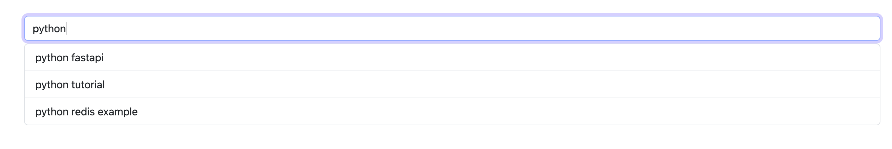

# Autocomplete Search with Redis and FastAPI

## Setup

1. Install dependencies

```bash
pip install -r requirements.txt
```

2. Run Redis server

```bash
docker run --name redis-autocomplete -d -p 6379:6379 redis
```
To check if the server is running, and print the keys, use the following command:

```bash
docker exec -it redis-autocomplete redis-cli
```
Then in redis-cli, type:

```bash
keys *
```

3. Insert search terms into Redis

```bash
python insert_search_terms.py
```
Check the keys again to see the search terms inserted.
```bash
keys *
```
and use
```bash
GET "python tutorial"
```
to see the popularity count of the search term.

4. Run the FastAPI server

```bash
uvicorn app.main:app --reload
```

# Screenshot
